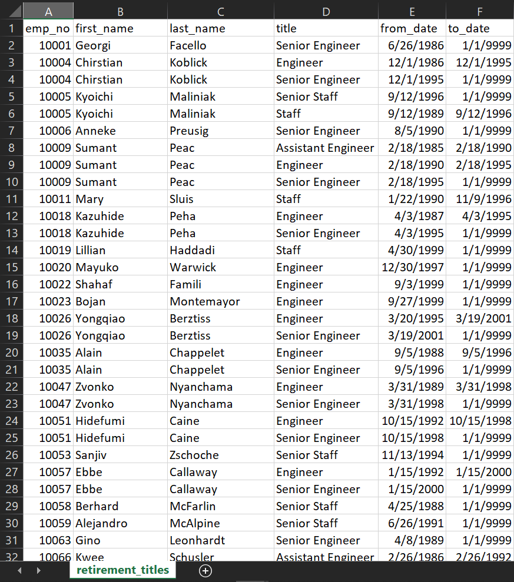
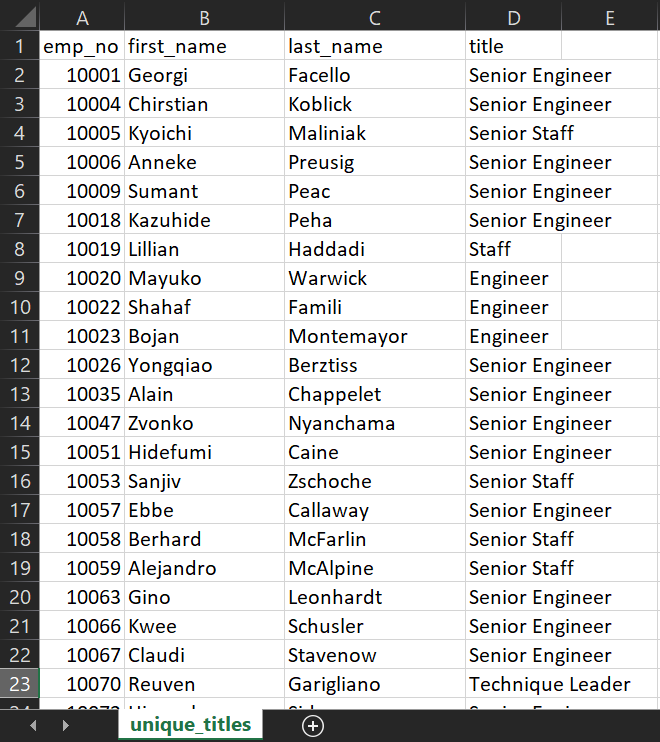
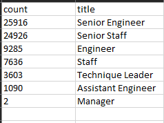
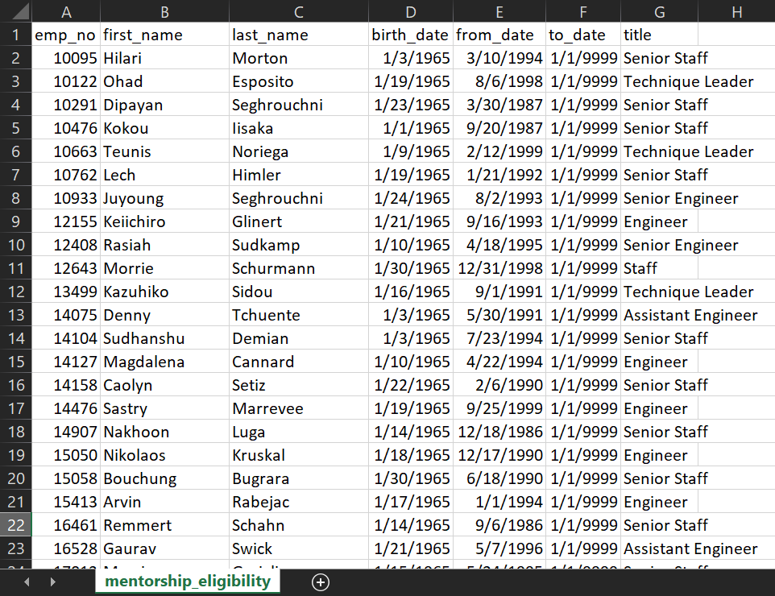
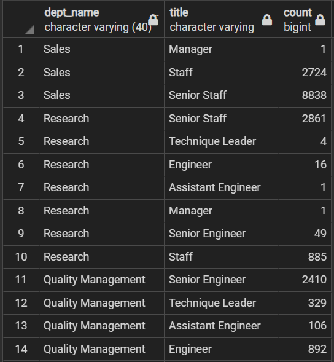

# Pewlett-Hackard-Analysis

## Overview of the Analysis:

The analysis of this project was done for a large company called Pewlett Hackard with the help of one of the companies HR Analysts named Bobby. The project’s goal was to ultimately future proof for a fast approaching "silver tsunami." At its core this entailed finding out who would be retiring, and what positions would need to be filled from the vacancies.
The project would begin by building a foundation from CSV files with the employees’ information, which would be manipulated using PostgreSQL. The CSV files were reviewed, database keys were identified, entity relationships determined; and using SQL the data was imported and organized to begin the actual analysis. The data on actually who and how many employees were retiring and subsequently the retirement eligibility was first collected. This data was focused down into smaller pieces and exported as new joined tables in CSV form for presentation to Bobby's boss.
Furthermore, specific SQL functions such as COUNT, GROUP BY and ORDER BY were utilized to parse the data into tailored lists to fulfill the requested information. This all culminated to the final two assignments: determine how many employees were retiring by title, and identifying the employees eligible to participate in a mentorship program.

## Results:

- A list of retiring employees was first created. This list was created with retiring age being determined by employees who were born between January 1, 1952 and December 31, 1955. This resulted in a massive list of 133,776 entries. The issue was that this list included duplicates due to employees being moved into different positions. Thus, the data was not unique and had to be tailored further.

 List of Retiring Employees

- The data was parsed to find only the current employees who were in the designated retirement age bracket with unique titles. This tailored out the duplicates that the previous list had. This amount totaled over 72,000+ employees.

 List of Retiring Employees Without Duplicates

- The analysis conducted on the number of employees by title showed that the Senior Engineer position would be the one with the most retirees. This was in stark contrast to the two Manager positions that would be vacated by a retiree.

 Count of Upcoming Retirees by Title

- A final piece of the analysis established who would be eligible for a mentorship program. This analysis was tailored to have current employees who were born between January 1, 1965 and December 31, 1965.

 List of Employees Eligible for Mentorship Program

## Summary:

### How many roles will need to be filled as the "silver tsunami" begins to make an impact?

As was pointed out earlier, a staggering number of roles would need to be filled. To get a better idea of the amount a query was created to break down the count of roles that needed to be filled per title in each department.

 List With Count of Roles to Fill by Department and Title

### Are there enough qualified, retirement-ready employees in the departments to mentor the next generation of Pewlett Hackard employees?

While the number of upcoming retirees is a large amount, this precludes a potential vaccuum of talent due to the respectively large number of employees who qualify for the mentorship program. This information can be garnered from the amount of employees who qualified for the mentorship program.
